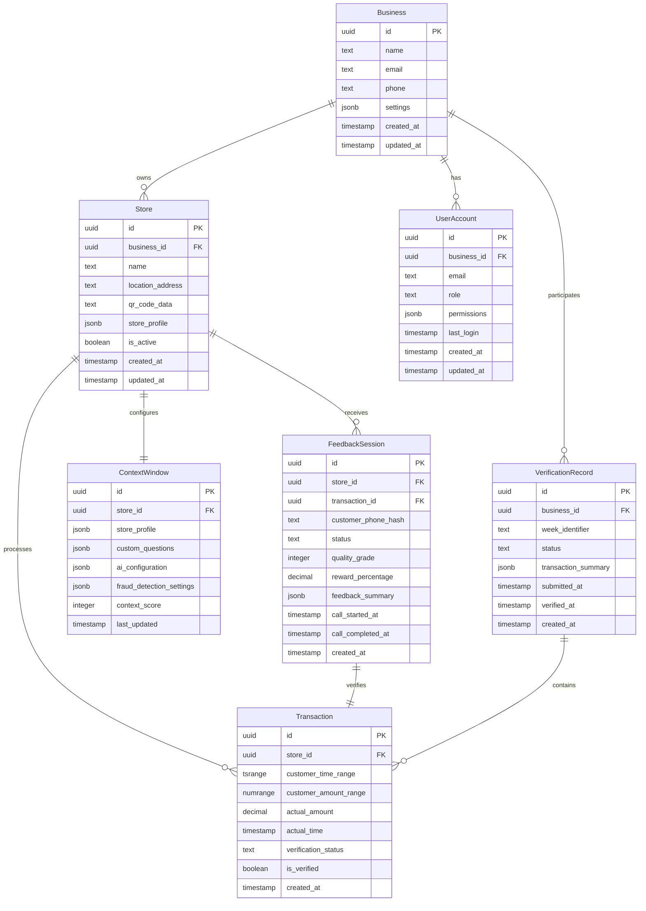

# Data Model: Database Foundation

**Date**: 2025-09-18
**Feature**: Database Foundation for Customer Feedback System
**Dependencies**: research.md (Phase 0 complete)

## Entity Relationship Overview



## Core Entities

### 1. Business
**Purpose**: Root entity representing a company with one or more physical stores

**Fields**:
- `id` (UUID, PK): Unique business identifier
- `name` (TEXT, NOT NULL): Business/company name
- `email` (TEXT, UNIQUE, NOT NULL): Primary business contact email
- `phone` (TEXT): Business phone number
- `settings` (JSONB): Business-wide configuration settings
- `created_at` (TIMESTAMP): Account creation time
- `updated_at` (TIMESTAMP): Last modification time

**Constraints**:
- Email must be unique across all businesses
- Name cannot be empty or null

**RLS Policies**:
```sql
-- Business isolation: Users can only access their own business
CREATE POLICY "business_isolation" ON businesses
FOR ALL USING (id = auth.jwt() ->> 'business_id'::uuid);

-- Admin full access
CREATE POLICY "admin_access" ON businesses
FOR ALL USING (auth.jwt() ->> 'role'::text = 'admin');
```

### 2. Store
**Purpose**: Physical store locations belonging to a business

**Fields**:
- `id` (UUID, PK): Unique store identifier
- `business_id` (UUID, FK): Reference to owning business
- `name` (TEXT, NOT NULL): Store name/identifier
- `location_address` (TEXT): Physical address
- `qr_code_data` (TEXT, UNIQUE): Embedded QR code identifier
- `store_profile` (JSONB): Store-specific configuration from context window
- `is_active` (BOOLEAN, DEFAULT TRUE): Store operational status
- `created_at` (TIMESTAMP): Store creation time
- `updated_at` (TIMESTAMP): Last modification time

**Constraints**:
- QR code data must be unique across all stores
- Each store must belong to exactly one business

**Indexes**:
```sql
-- Primary access pattern: business stores
CREATE INDEX idx_stores_business_id ON stores (business_id);

-- QR code lookup optimization
CREATE UNIQUE INDEX idx_stores_qr_code ON stores (qr_code_data);

-- Active stores filtering
CREATE INDEX idx_stores_active ON stores (business_id, is_active) WHERE is_active = true;
```

**RLS Policies**:
```sql
-- Store access within business
CREATE POLICY "store_business_isolation" ON stores
FOR ALL USING (business_id = auth.jwt() ->> 'business_id'::uuid);

-- Public QR code access for customer verification
CREATE POLICY "public_qr_lookup" ON stores
FOR SELECT USING (is_active = true);
```

### 3. UserAccount
**Purpose**: Authenticated users (business owners, staff, admin)

**Fields**:
- `id` (UUID, PK): Unique user identifier
- `business_id` (UUID, FK, NULLABLE): Associated business (null for admin users)
- `email` (TEXT, UNIQUE): User email address
- `role` (TEXT): User role (admin, business_owner, business_staff)
- `permissions` (JSONB): Role-specific permissions
- `last_login` (TIMESTAMP): Last authentication time
- `created_at` (TIMESTAMP): Account creation time
- `updated_at` (TIMESTAMP): Last modification time

**Constraints**:
- Email must be unique across all user accounts
- Admin users have null business_id
- Business users must have valid business_id

**RLS Policies**:
```sql
-- Users can access their own account
CREATE POLICY "own_account_access" ON user_accounts
FOR ALL USING (id = auth.uid());

-- Business owners can access their business staff
CREATE POLICY "business_staff_access" ON user_accounts
FOR SELECT USING (
  business_id = auth.jwt() ->> 'business_id'::uuid
  AND auth.jwt() ->> 'role'::text = 'business_owner'
);

-- Admin access to all accounts
CREATE POLICY "admin_user_access" ON user_accounts
FOR ALL USING (auth.jwt() ->> 'role'::text = 'admin');
```

### 4. FeedbackSession
**Purpose**: Customer feedback collection through AI phone calls

**Fields**:
- `id` (UUID, PK): Unique session identifier
- `store_id` (UUID, FK): Store where feedback was collected
- `transaction_id` (UUID, FK): Associated transaction verification
- `customer_phone_hash` (TEXT): Hashed customer phone number (privacy)
- `status` (TEXT): Session status (initiated, in_progress, completed, failed)
- `quality_grade` (INTEGER): AI-generated feedback quality score (1-10)
- `reward_percentage` (DECIMAL): Calculated cashback percentage (2-15%)
- `feedback_summary` (JSONB): AI-summarized feedback content
- `call_started_at` (TIMESTAMP): Phone call initiation time
- `call_completed_at` (TIMESTAMP): Phone call completion time
- `created_at` (TIMESTAMP): Session creation time

**Constraints**:
- Quality grade must be between 1 and 10
- Reward percentage must be between 2.0 and 15.0
- Phone hash ensures privacy while enabling duplicate detection

**Indexes**:
```sql
-- Primary access: store feedback sessions by time
CREATE INDEX idx_feedback_sessions_store_time ON feedback_sessions
(store_id, created_at DESC);

-- Quality analysis queries
CREATE INDEX idx_feedback_sessions_quality ON feedback_sessions
(store_id, quality_grade, created_at);

-- Weekly verification queries
CREATE INDEX idx_feedback_sessions_verification ON feedback_sessions
(transaction_id, status) WHERE status = 'completed';
```

**RLS Policies**:
```sql
-- Feedback sessions accessible by store's business
CREATE POLICY "feedback_business_access" ON feedback_sessions
FOR ALL USING (
  store_id IN (
    SELECT id FROM stores
    WHERE business_id = auth.jwt() ->> 'business_id'::uuid
  )
);

-- Customer phone numbers hidden from businesses
CREATE POLICY "hide_customer_phone" ON feedback_sessions
FOR SELECT USING (
  CASE WHEN auth.jwt() ->> 'role'::text = 'admin'
  THEN true
  ELSE customer_phone_hash IS NULL  -- Force null for business users
  END
);
```

### 5. Transaction
**Purpose**: Customer transaction verification with tolerance matching

**Fields**:
- `id` (UUID, PK): Unique transaction identifier
- `store_id` (UUID, FK): Store where transaction occurred
- `customer_time_range` (TSRANGE): Time tolerance range (±2 minutes)
- `customer_amount_range` (NUMRANGE): Amount tolerance range (±2 SEK)
- `actual_amount` (DECIMAL): POS-verified transaction amount
- `actual_time` (TIMESTAMP): POS-verified transaction time
- `verification_status` (TEXT): Verification state (pending, verified, rejected)
- `is_verified` (BOOLEAN): Final verification result
- `created_at` (TIMESTAMP): Transaction record creation time

**Constraints**:
- Time range must be exactly 4 minutes wide (±2 minutes)
- Amount range must be exactly 4 SEK wide (±2 SEK)
- Verification status must be valid enum value

**Indexes**:
```sql
-- Tolerance matching optimization with GiST
CREATE INDEX idx_transactions_tolerance ON transactions
USING GIST (customer_time_range, customer_amount_range);

-- Store verification queries
CREATE INDEX idx_transactions_store_verification ON transactions
(store_id, verification_status, created_at);

-- Weekly verification workflow
CREATE INDEX idx_transactions_weekly ON transactions
(store_id, created_at) WHERE verification_status = 'pending';
```

**RLS Policies**:
```sql
-- Transactions accessible by store's business
CREATE POLICY "transaction_business_access" ON transactions
FOR ALL USING (
  store_id IN (
    SELECT id FROM stores
    WHERE business_id = auth.jwt() ->> 'business_id'::uuid
  )
);
```

### 6. ContextWindow
**Purpose**: Business-specific AI guidance and store configuration

**Fields**:
- `id` (UUID, PK): Unique context window identifier
- `store_id` (UUID, FK): Associated store (one-to-one relationship)
- `store_profile` (JSONB): Store type, size, layout, personnel information
- `custom_questions` (JSONB): Business-defined questions with frequency settings
- `ai_configuration` (JSONB): AI behavior settings and conversation guidelines
- `fraud_detection_settings` (JSONB): Fraud detection thresholds and keywords
- `context_score` (INTEGER): Completeness score (0-100)
- `last_updated` (TIMESTAMP): Last configuration change

**Constraints**:
- One context window per store (unique store_id)
- Context score must be between 0 and 100

**Indexes**:
```sql
-- Store context lookup
CREATE UNIQUE INDEX idx_context_window_store ON context_window (store_id);

-- Context completeness analysis
CREATE INDEX idx_context_window_score ON context_window (context_score);
```

**RLS Policies**:
```sql
-- Context window accessible by store's business
CREATE POLICY "context_business_access" ON context_window
FOR ALL USING (
  store_id IN (
    SELECT id FROM stores
    WHERE business_id = auth.jwt() ->> 'business_id'::uuid
  )
);
```

### 7. VerificationRecord
**Purpose**: Weekly verification cycle tracking

**Fields**:
- `id` (UUID, PK): Unique verification record identifier
- `business_id` (UUID, FK): Business participating in verification
- `week_identifier` (TEXT): Week identifier (e.g., "2025-W03")
- `status` (TEXT): Verification status (pending, submitted, completed)
- `transaction_summary` (JSONB): Aggregated transaction data for business review
- `submitted_at` (TIMESTAMP): When business submitted verification
- `verified_at` (TIMESTAMP): When admin completed verification
- `created_at` (TIMESTAMP): Record creation time

**Constraints**:
- One verification record per business per week
- Week identifier must follow ISO 8601 week format

**Indexes**:
```sql
-- Weekly verification lookup
CREATE UNIQUE INDEX idx_verification_business_week ON verification_record
(business_id, week_identifier);

-- Admin verification workflow
CREATE INDEX idx_verification_status ON verification_record
(status, created_at);
```

**RLS Policies**:
```sql
-- Verification records accessible by business
CREATE POLICY "verification_business_access" ON verification_record
FOR ALL USING (business_id = auth.jwt() ->> 'business_id'::uuid);

-- Admin access to all verification records
CREATE POLICY "verification_admin_access" ON verification_record
FOR ALL USING (auth.jwt() ->> 'role'::text = 'admin');
```

## Database Schema Implementation

### Enums
```sql
-- User roles
CREATE TYPE user_role AS ENUM ('admin', 'business_owner', 'business_staff');

-- Feedback session status
CREATE TYPE feedback_status AS ENUM ('initiated', 'in_progress', 'completed', 'failed');

-- Transaction verification status
CREATE TYPE verification_status AS ENUM ('pending', 'verified', 'rejected');

-- Weekly verification status
CREATE TYPE weekly_verification_status AS ENUM ('pending', 'submitted', 'completed');
```

### Functions
```sql
-- Generate time tolerance range
CREATE OR REPLACE FUNCTION create_time_tolerance(customer_time TIMESTAMP)
RETURNS TSRANGE AS $$
BEGIN
  RETURN tsrange(
    customer_time - INTERVAL '2 minutes',
    customer_time + INTERVAL '2 minutes',
    '[]'
  );
END;
$$ LANGUAGE plpgsql IMMUTABLE;

-- Generate amount tolerance range
CREATE OR REPLACE FUNCTION create_amount_tolerance(customer_amount DECIMAL)
RETURNS NUMRANGE AS $$
BEGIN
  RETURN numrange(
    customer_amount - 2.0,
    customer_amount + 2.0,
    '[]'
  );
END;
$$ LANGUAGE plpgsql IMMUTABLE;

-- Update context score based on completeness
CREATE OR REPLACE FUNCTION calculate_context_score(context_data JSONB)
RETURNS INTEGER AS $$
DECLARE
  score INTEGER := 0;
BEGIN
  -- Calculate score based on completeness of various fields
  IF context_data ? 'store_profile' THEN score := score + 25; END IF;
  IF context_data ? 'custom_questions' THEN score := score + 25; END IF;
  IF context_data ? 'ai_configuration' THEN score := score + 25; END IF;
  IF context_data ? 'fraud_detection_settings' THEN score := score + 25; END IF;

  RETURN score;
END;
$$ LANGUAGE plpgsql IMMUTABLE;
```

## Security Model

### Authentication Integration
- Supabase Auth JWT tokens contain `business_id` and `role` claims
- RLS policies enforce business isolation using JWT claims
- Admin users have special `role='admin'` for cross-business access

### Privacy Protection
- Customer phone numbers stored as hashes only
- Feedback content summarized and anonymized by AI
- Business users cannot access raw customer contact information

### Data Isolation
- Complete business separation through RLS policies
- Multi-store businesses maintain internal access control
- Admin users have system-wide access for verification workflows

## Performance Optimizations

### Indexing Strategy
- Composite indexes on common query patterns (business_id + timestamp)
- GiST indexes for tolerance range matching
- Partial indexes for filtered queries (active stores, pending verifications)

### Query Patterns
- Business-scoped queries are the primary access pattern
- Time-based filtering for feedback analysis and reporting
- Tolerance matching for transaction verification

This data model provides a secure, scalable foundation for the customer feedback system while maintaining strict business isolation and supporting all required workflows.