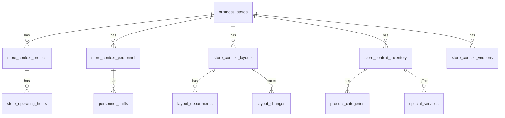

# Data Model: Business Context Window

**Phase 1 Design** | **Date**: 2025-09-21 | **Feature**: 005-step-2-3

## Entity Relationship Overview



## Core Entities

### store_context_profiles

**Purpose**: Basic store characteristics and operational information  
**Relationships**: Extends business_stores (1:1), has operating_hours (1:many)

| Field                  | Type        | Constraints           | Description                                     |
| ---------------------- | ----------- | --------------------- | ----------------------------------------------- |
| id                     | uuid        | PRIMARY KEY           | Unique profile identifier                       |
| store_id               | uuid        | FOREIGN KEY, NOT NULL | Reference to business_stores.id                 |
| store_type             | text        | NOT NULL              | Category (grocery, electronics, clothing, etc.) |
| store_subtype          | text        | NULL                  | Subcategory for specific business type          |
| square_footage         | integer     | CHECK > 0             | Store size in square meters                     |
| department_count       | integer     | CHECK >= 1            | Number of distinct departments                  |
| layout_type            | text        | NOT NULL              | linear, grid, free-form, multi-level            |
| address_line_1         | text        | NOT NULL              | Street address                                  |
| address_line_2         | text        | NULL                  | Additional address info                         |
| city                   | text        | NOT NULL              | City name                                       |
| postal_code            | text        | NOT NULL              | Postal/ZIP code                                 |
| parking_available      | boolean     | DEFAULT false         | Parking availability                            |
| accessibility_features | text[]      | DEFAULT '{}'          | List of accessibility options                   |
| created_at             | timestamptz | DEFAULT now()         | Record creation time                            |
| updated_at             | timestamptz | DEFAULT now()         | Last modification time                          |

**Validation Rules**:

- store_type must be from predefined enum
- square_footage must be positive integer
- department_count must be at least 1
- layout_type must be from predefined enum

### store_operating_hours

**Purpose**: Daily and special operating schedules  
**Relationships**: Belongs to store_context_profiles (many:1)

| Field            | Type    | Constraints           | Description                            |
| ---------------- | ------- | --------------------- | -------------------------------------- |
| id               | uuid    | PRIMARY KEY           | Unique schedule identifier             |
| profile_id       | uuid    | FOREIGN KEY, NOT NULL | Reference to store_context_profiles.id |
| day_of_week      | integer | CHECK 0-6             | 0=Sunday, 6=Saturday                   |
| open_time        | time    | NULL                  | Opening time (NULL = closed)           |
| close_time       | time    | NULL                  | Closing time (NULL = closed)           |
| is_special_hours | boolean | DEFAULT false         | Holiday/special schedule               |
| special_date     | date    | NULL                  | Specific date for special hours        |
| notes            | text    | NULL                  | Additional schedule information        |

**Validation Rules**:

- close_time must be after open_time (same day) or NULL
- special_date required when is_special_hours = true
- day_of_week must be 0-6

### store_context_personnel

**Purpose**: Staff information and organizational structure  
**Relationships**: Extends business_stores (1:1), has personnel_shifts (1:many)

| Field                   | Type        | Constraints           | Description                        |
| ----------------------- | ----------- | --------------------- | ---------------------------------- |
| id                      | uuid        | PRIMARY KEY           | Unique personnel record identifier |
| store_id                | uuid        | FOREIGN KEY, NOT NULL | Reference to business_stores.id    |
| total_staff_count       | integer     | CHECK >= 1            | Total number of employees          |
| manager_name            | text        | NOT NULL              | Store manager name                 |
| assistant_manager_name  | text        | NULL                  | Assistant manager name             |
| customer_service_points | jsonb       | NOT NULL              | Service desk locations and staff   |
| department_heads        | jsonb       | DEFAULT '{}'          | Department managers                |
| staff_expertise_areas   | text[]      | DEFAULT '{}'          | Special skills/certifications      |
| created_at              | timestamptz | DEFAULT now()         | Record creation time               |
| updated_at              | timestamptz | DEFAULT now()         | Last modification time             |

**JSONB Schemas**:

```json
customer_service_points: [
  {
    "location": "main entrance",
    "type": "information_desk",
    "staff_count": 2,
    "hours": "09:00-21:00"
  }
]

department_heads: {
  "electronics": "John Smith",
  "clothing": "Jane Doe",
  "grocery": "Bob Johnson"
}
```

### personnel_shifts

**Purpose**: Shift-based staff allocation and scheduling  
**Relationships**: Belongs to store_context_personnel (many:1)

| Field                 | Type      | Constraints           | Description                             |
| --------------------- | --------- | --------------------- | --------------------------------------- |
| id                    | uuid      | PRIMARY KEY           | Unique shift identifier                 |
| personnel_id          | uuid      | FOREIGN KEY, NOT NULL | Reference to store_context_personnel.id |
| shift_name            | text      | NOT NULL              | morning, afternoon, evening, night      |
| start_time            | time      | NOT NULL              | Shift start time                        |
| end_time              | time      | NOT NULL              | Shift end time                          |
| staff_count           | integer   | CHECK >= 1            | Number of staff during shift            |
| department_allocation | jsonb     | NOT NULL              | Staff per department                    |
| days_of_week          | integer[] | NOT NULL              | Array of days (0-6)                     |

**JSONB Schema**:

```json
department_allocation: {
  "checkout": 3,
  "electronics": 2,
  "grocery": 4,
  "customer_service": 1
}
```

### store_context_layouts

**Purpose**: Physical store layout and department positioning  
**Relationships**: Extends business_stores (1:1), has layout_departments and
layout_changes (1:many)

| Field                 | Type        | Constraints           | Description                             |
| --------------------- | ----------- | --------------------- | --------------------------------------- |
| id                    | uuid        | PRIMARY KEY           | Unique layout identifier                |
| store_id              | uuid        | FOREIGN KEY, NOT NULL | Reference to business_stores.id         |
| layout_image_url      | text        | NULL                  | Store map image from Supabase Storage   |
| entrance_count        | integer     | CHECK >= 1            | Number of store entrances               |
| exit_count            | integer     | CHECK >= 1            | Number of store exits                   |
| checkout_locations    | jsonb       | NOT NULL              | Checkout counter positions              |
| customer_flow_pattern | text        | NOT NULL              | clockwise, counterclockwise, grid, free |
| special_areas         | jsonb       | DEFAULT '{}'          | Returns, pickup, service areas          |
| created_at            | timestamptz | DEFAULT now()         | Record creation time                    |
| updated_at            | timestamptz | DEFAULT now()         | Last modification time                  |

**JSONB Schemas**:

```json
checkout_locations: [
  {
    "id": "main_checkout",
    "position": {"x": 100, "y": 200},
    "counter_count": 8,
    "express_lanes": 2
  }
]

special_areas: {
  "customer_service": {"position": {"x": 50, "y": 50}, "size": "large"},
  "returns": {"position": {"x": 80, "y": 60}, "size": "medium"},
  "pickup": {"position": {"x": 120, "y": 40}, "size": "small"}
}
```

### layout_departments

**Purpose**: Department positioning within store layout  
**Relationships**: Belongs to store_context_layouts (many:1)

| Field              | Type    | Constraints           | Description                           |
| ------------------ | ------- | --------------------- | ------------------------------------- |
| id                 | uuid    | PRIMARY KEY           | Unique department position identifier |
| layout_id          | uuid    | FOREIGN KEY, NOT NULL | Reference to store_context_layouts.id |
| department_name    | text    | NOT NULL              | Department identifier                 |
| position_x         | integer | NOT NULL              | X coordinate on layout                |
| position_y         | integer | NOT NULL              | Y coordinate on layout                |
| width              | integer | CHECK > 0             | Department width                      |
| height             | integer | CHECK > 0             | Department height                     |
| department_type    | text    | NOT NULL              | product, service, infrastructure      |
| adjacency_priority | integer | DEFAULT 0             | Importance of location                |

### layout_changes

**Purpose**: Track layout modifications over time  
**Relationships**: Belongs to store_context_layouts (many:1)

| Field                | Type   | Constraints           | Description                            |
| -------------------- | ------ | --------------------- | -------------------------------------- |
| id                   | uuid   | PRIMARY KEY           | Unique change identifier               |
| layout_id            | uuid   | FOREIGN KEY, NOT NULL | Reference to store_context_layouts.id  |
| change_date          | date   | NOT NULL              | Date of layout change                  |
| change_type          | text   | NOT NULL              | renovation, expansion, department_move |
| change_description   | text   | NOT NULL              | Detailed change description            |
| affected_departments | text[] | NOT NULL              | List of affected departments           |
| reason               | text   | NULL                  | Reason for change                      |

### store_context_inventory

**Purpose**: Product categories and service offerings  
**Relationships**: Extends business_stores (1:1), has product_categories and
special_services (1:many)

| Field               | Type        | Constraints           | Description                          |
| ------------------- | ----------- | --------------------- | ------------------------------------ |
| id                  | uuid        | PRIMARY KEY           | Unique inventory context identifier  |
| store_id            | uuid        | FOREIGN KEY, NOT NULL | Reference to business_stores.id      |
| primary_categories  | text[]      | NOT NULL              | Main product categories              |
| payment_methods     | text[]      | NOT NULL              | Accepted payment options             |
| loyalty_programs    | jsonb       | DEFAULT '{}'          | Existing customer programs           |
| seasonal_variations | jsonb       | DEFAULT '{}'          | Seasonal inventory changes           |
| price_range         | text        | NOT NULL              | budget, mid-range, premium, luxury   |
| brand_focus         | text        | NOT NULL              | national_brands, store_brands, mixed |
| created_at          | timestamptz | DEFAULT now()         | Record creation time                 |
| updated_at          | timestamptz | DEFAULT now()         | Last modification time               |

### product_categories

**Purpose**: Detailed product category hierarchy  
**Relationships**: Belongs to store_context_inventory (many:1)

| Field                    | Type    | Constraints           | Description                             |
| ------------------------ | ------- | --------------------- | --------------------------------------- |
| id                       | uuid    | PRIMARY KEY           | Unique category identifier              |
| inventory_id             | uuid    | FOREIGN KEY, NOT NULL | Reference to store_context_inventory.id |
| category_name            | text    | NOT NULL              | Category identifier                     |
| subcategories            | text[]  | DEFAULT '{}'          | Subcategory list                        |
| department_location      | text    | NOT NULL              | Physical department name                |
| seasonal_availability    | jsonb   | NULL                  | Seasonal product variations             |
| staff_expertise_required | boolean | DEFAULT false         | Requires specialized staff              |

### special_services

**Purpose**: Non-product services offered by store  
**Relationships**: Belongs to store_context_inventory (many:1)

| Field                 | Type  | Constraints           | Description                                  |
| --------------------- | ----- | --------------------- | -------------------------------------------- |
| id                    | uuid  | PRIMARY KEY           | Unique service identifier                    |
| inventory_id          | uuid  | FOREIGN KEY, NOT NULL | Reference to store_context_inventory.id      |
| service_name          | text  | NOT NULL              | Service identifier                           |
| service_type          | text  | NOT NULL              | delivery, installation, custom_order, repair |
| availability_schedule | jsonb | NOT NULL              | When service is available                    |
| cost_structure        | text  | NOT NULL              | free, fee_based, purchase_dependent          |
| staff_requirements    | text  | NULL                  | Special staff/certification needs            |

### store_context_versions

**Purpose**: Track context changes and enable rollback  
**Relationships**: Belongs to business_stores (many:1)

| Field            | Type        | Constraints           | Description                        |
| ---------------- | ----------- | --------------------- | ---------------------------------- |
| id               | uuid        | PRIMARY KEY           | Unique version identifier          |
| store_id         | uuid        | FOREIGN KEY, NOT NULL | Reference to business_stores.id    |
| version_number   | integer     | NOT NULL              | Incremental version counter        |
| change_summary   | text        | NOT NULL              | Brief description of changes       |
| changed_sections | text[]      | NOT NULL              | Which context sections changed     |
| change_reason    | text        | NULL                  | Reason for context update          |
| created_by       | uuid        | FOREIGN KEY           | User who made changes              |
| created_at       | timestamptz | DEFAULT now()         | Version creation time              |
| context_snapshot | jsonb       | NOT NULL              | Full context state at this version |

## Computed Fields & Indexes

### Context Completeness Scoring

```sql
-- Computed column for context completeness percentage
completeness_score AS (
  CASE
    WHEN profile_complete AND personnel_complete AND layout_complete AND inventory_complete THEN 100
    WHEN (profile_complete::int + personnel_complete::int + layout_complete::int + inventory_complete::int) >= 3 THEN 75
    WHEN (profile_complete::int + personnel_complete::int + layout_complete::int + inventory_complete::int) >= 2 THEN 50
    ELSE 25
  END
)
```

### Required Indexes

```sql
-- Performance indexes for context queries
CREATE INDEX idx_store_context_store_id ON store_context_profiles(store_id);
CREATE INDEX idx_context_completeness ON store_context_profiles(completeness_score);
CREATE INDEX idx_layout_changes_date ON layout_changes(layout_id, change_date DESC);
CREATE INDEX idx_context_versions_store ON store_context_versions(store_id, version_number DESC);

-- AI integration indexes
CREATE INDEX idx_context_ai_lookup ON store_context_profiles(store_id)
  INCLUDE (store_type, layout_type, department_count);
```

## Row Level Security (RLS) Policies

### Business Isolation Pattern

All context tables inherit business-level isolation from existing
business_stores RLS:

```sql
-- Example RLS policy pattern (applied to all context tables)
CREATE POLICY "business_context_isolation" ON store_context_profiles
  FOR ALL USING (
    store_id IN (
      SELECT id FROM business_stores
      WHERE business_id = auth.jwt() ->> 'business_id'
    )
  );
```

### Permission-Based Access

Context modification requires 'manage_context' permission:

```sql
CREATE POLICY "context_write_permission" ON store_context_profiles
  FOR INSERT, UPDATE USING (
    store_id IN (
      SELECT bs.id FROM business_stores bs
      JOIN business_store_permissions bsp ON bs.id = bsp.store_id
      WHERE bs.business_id = auth.jwt() ->> 'business_id'
        AND bsp.user_id = auth.uid()
        AND 'manage_context' = ANY(bsp.permissions)
    )
  );
```

## State Transitions

### Context Lifecycle

1. **Empty** → Profile creation
2. **Profile Complete** → Personnel addition
3. **Personnel Complete** → Layout documentation
4. **Layout Complete** → Inventory configuration
5. **Complete** → Ongoing maintenance and versioning

### Validation States

- **Invalid**: Missing required fields or validation errors
- **Incomplete**: Some sections missing but valid
- **Complete**: All sections filled with valid data
- **Optimized**: Complete with AI optimization suggestions applied

---

_Data model complete - Ready for API contract generation_
