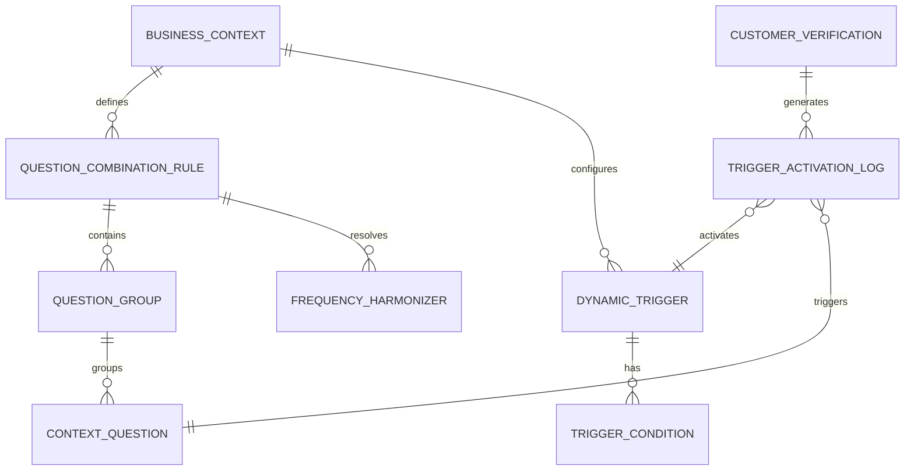

# Data Model: Advanced Question Logic

**Feature**: Step 5.2: Advanced Question Logic
**Date**: 2025-09-24
**Status**: Phase 1 Design

## Entity Relationship Overview



## Core Entities

### Question Combination Rule
**Purpose**: Defines how multiple questions can be grouped together for optimal call flow

| Field | Type | Constraints | Description |
|-------|------|-------------|-------------|
| id | UUID | PK, NOT NULL | Unique identifier |
| business_context_id | UUID | FK, NOT NULL | Links to business context |
| rule_name | VARCHAR(100) | NOT NULL | Business-friendly name |
| max_call_duration_seconds | INTEGER | DEFAULT 120, CHECK (60-180) | Maximum call duration limit |
| priority_threshold_critical | INTEGER | DEFAULT 0 | Time remaining for critical questions (seconds) |
| priority_threshold_high | INTEGER | DEFAULT 60 | Time remaining for high priority questions |
| priority_threshold_medium | INTEGER | DEFAULT 90 | Time remaining for medium priority questions |
| priority_threshold_low | INTEGER | DEFAULT 120 | Time remaining for low priority questions |
| is_active | BOOLEAN | DEFAULT true | Rule activation status |
| created_at | TIMESTAMPTZ | NOT NULL | Creation timestamp |
| updated_at | TIMESTAMPTZ | NOT NULL | Last modification timestamp |

**Validation Rules**:
- Priority thresholds must be ascending: critical ≤ high ≤ medium ≤ low
- Max call duration must be within 60-180 second range
- Rule name must be unique per business context

### Dynamic Trigger
**Purpose**: Conditions that automatically activate specific questions based on customer data

| Field | Type | Constraints | Description |
|-------|------|-------------|-------------|
| id | UUID | PK, NOT NULL | Unique identifier |
| business_context_id | UUID | FK, NOT NULL | Links to business context |
| trigger_name | VARCHAR(100) | NOT NULL | Business-friendly name |
| trigger_type | ENUM | NOT NULL | 'purchase_based', 'time_based', 'amount_based' |
| priority_level | INTEGER | CHECK (1-5), DEFAULT 3 | Priority weight (1=Optional, 5=Critical) |
| sensitivity_threshold | INTEGER | CHECK (1-100), DEFAULT 10 | Every Nth customer threshold |
| is_active | BOOLEAN | DEFAULT true | Trigger activation status |
| trigger_config | JSONB | NOT NULL | Type-specific configuration data |
| effectiveness_score | DECIMAL(3,2) | DEFAULT 0.0 | Calculated effectiveness (0.0-1.0) |
| created_at | TIMESTAMPTZ | NOT NULL | Creation timestamp |
| updated_at | TIMESTAMPTZ | NOT NULL | Last modification timestamp |

**Trigger Config Schema by Type**:
```typescript
// purchase_based
{
  categories: string[];           // e.g., ["meat", "bakery", "produce"]
  required_items?: string[];      // Specific item names
  minimum_items?: number;         // Minimum items from category
}

// time_based
{
  time_windows: Array<{
    start_time: string;          // "HH:MM" format
    end_time: string;            // "HH:MM" format
    days_of_week: number[];      // [0-6] Sunday=0
  }>;
}

// amount_based
{
  currency: string;              // "SEK"
  minimum_amount: number;        // Threshold amount
  maximum_amount?: number;       // Optional upper bound
  comparison_operator: ">="|"<="|"=="|"between";
}
```

### Question Group
**Purpose**: Collection of related questions that work well together in conversation flow

| Field | Type | Constraints | Description |
|-------|------|-------------|-------------|
| id | UUID | PK, NOT NULL | Unique identifier |
| rule_id | UUID | FK, NOT NULL | Links to combination rule |
| group_name | VARCHAR(100) | NOT NULL | Topic/theme name |
| topic_category | VARCHAR(50) | NOT NULL | Semantic category |
| estimated_tokens | INTEGER | NOT NULL, CHECK (>0) | Token estimate for group |
| display_order | INTEGER | NOT NULL, DEFAULT 0 | Conversation flow ordering |
| is_active | BOOLEAN | DEFAULT true | Group activation status |
| created_at | TIMESTAMPTZ | NOT NULL | Creation timestamp |

### Trigger Condition
**Purpose**: Specific conditions that must be met for trigger activation

| Field | Type | Constraints | Description |
|-------|------|-------------|-------------|
| id | UUID | PK, NOT NULL | Unique identifier |
| trigger_id | UUID | FK, NOT NULL | Links to dynamic trigger |
| condition_key | VARCHAR(50) | NOT NULL | Data field to evaluate |
| condition_operator | VARCHAR(10) | NOT NULL | Comparison operator |
| condition_value | TEXT | NOT NULL | Value to compare against |
| is_required | BOOLEAN | DEFAULT true | Must match for trigger activation |
| created_at | TIMESTAMPTZ | NOT NULL | Creation timestamp |

### Frequency Harmonizer
**Purpose**: Business-configurable logic for resolving question frequency conflicts

| Field | Type | Constraints | Description |
|-------|------|-------------|-------------|
| id | UUID | PK, NOT NULL | Unique identifier |
| rule_id | UUID | FK, NOT NULL | Links to combination rule |
| question_pair_hash | VARCHAR(64) | NOT NULL | Hash of question ID pair |
| question_id_1 | UUID | FK, NOT NULL | First question in conflict |
| question_id_2 | UUID | FK, NOT NULL | Second question in conflict |
| resolution_strategy | ENUM | NOT NULL | 'combine', 'priority', 'alternate', 'custom' |
| custom_frequency | INTEGER | NULL | Custom interval for resolution |
| priority_question_id | UUID | FK, NULL | Prioritized question if strategy=priority |
| created_at | TIMESTAMPTZ | NOT NULL | Creation timestamp |
| updated_at | TIMESTAMPTZ | NOT NULL | Last modification timestamp |

**Unique Constraints**:
- (rule_id, question_pair_hash) - One resolution per question pair per rule
- question_id_1 < question_id_2 (enforce ordering to prevent duplicates)

### Trigger Activation Log
**Purpose**: Audit trail of which triggers fired for each customer interaction

| Field | Type | Constraints | Description |
|-------|------|-------------|-------------|
| id | UUID | PK, NOT NULL | Unique identifier |
| verification_id | UUID | FK, NOT NULL | Links to customer verification |
| trigger_id | UUID | FK, NOT NULL | Which trigger activated |
| question_id | UUID | FK, NOT NULL | Which question was triggered |
| trigger_data | JSONB | NOT NULL | Customer data that caused trigger |
| activation_timestamp | TIMESTAMPTZ | NOT NULL | When trigger fired |
| call_position | INTEGER | NOT NULL | Order in call sequence |
| was_asked | BOOLEAN | DEFAULT false | Whether question was actually asked |
| skip_reason | TEXT | NULL | Why skipped (if was_asked=false) |

### Priority Weight
**Purpose**: 5-level numerical scoring for question importance

| Field | Type | Constraints | Description |
|-------|------|-------------|-------------|
| id | UUID | PK, NOT NULL | Unique identifier |
| question_id | UUID | FK, NOT NULL | Links to context question |
| priority_level | INTEGER | CHECK (1-5), NOT NULL | 1=Optional, 5=Critical |
| weight_multiplier | DECIMAL(3,2) | DEFAULT 1.0 | Fine-tuning multiplier |
| effective_priority | DECIMAL(5,2) | COMPUTED | priority_level * weight_multiplier |
| assigned_by | UUID | FK, NOT NULL | Admin/business user who set priority |
| assigned_at | TIMESTAMPTZ | NOT NULL | When priority was set |
| is_system_assigned | BOOLEAN | DEFAULT false | Auto-assigned vs manual |

### Time Constraint Optimizer
**Purpose**: Algorithm metadata and caching for question combination calculations

| Field | Type | Constraints | Description |
|-------|------|-------------|-------------|
| id | UUID | PK, NOT NULL | Unique identifier |
| business_context_id | UUID | FK, NOT NULL | Links to business context |
| optimization_version | INTEGER | NOT NULL, DEFAULT 1 | Algorithm version |
| cached_combinations | JSONB | NOT NULL | Pre-calculated optimal combinations |
| total_token_budget | INTEGER | NOT NULL | Maximum tokens for call |
| average_response_tokens | INTEGER | DEFAULT 20 | Expected customer response length |
| last_optimized | TIMESTAMPTZ | NOT NULL | Cache generation timestamp |
| cache_expiry | TIMESTAMPTZ | NOT NULL | When to regenerate cache |

## Database Schema Extensions

### New Tables to Create
```sql
-- Core logic tables
CREATE TABLE question_combination_rules (...);
CREATE TABLE dynamic_triggers (...);
CREATE TABLE question_groups (...);
CREATE TABLE trigger_conditions (...);
CREATE TABLE frequency_harmonizers (...);
CREATE TABLE trigger_activation_logs (...);
CREATE TABLE priority_weights (...);
CREATE TABLE time_constraint_optimizers (...);

-- Indexes for performance
CREATE INDEX idx_triggers_business_active ON dynamic_triggers(business_context_id, is_active);
CREATE INDEX idx_activation_logs_verification ON trigger_activation_logs(verification_id);
CREATE INDEX idx_priority_weights_question ON priority_weights(question_id);
CREATE INDEX idx_harmonizers_rule_active ON frequency_harmonizers(rule_id);
```

### Existing Tables to Extend
```sql
-- Add priority support to existing context_questions table
ALTER TABLE context_questions
ADD COLUMN default_priority_level INTEGER DEFAULT 3 CHECK (default_priority_level BETWEEN 1 AND 5),
ADD COLUMN estimated_tokens INTEGER DEFAULT 30 CHECK (estimated_tokens > 0),
ADD COLUMN topic_category VARCHAR(50) DEFAULT 'general';

-- Add trigger tracking to customer_verifications table
ALTER TABLE customer_verifications
ADD COLUMN questions_selected JSONB DEFAULT '[]'::jsonb,
ADD COLUMN total_estimated_duration INTEGER DEFAULT 0,
ADD COLUMN actual_call_duration INTEGER DEFAULT 0;
```

## State Transitions

### Question Selection Flow
```
Customer Verification Created
↓
Evaluate Active Triggers (Dynamic Trigger → Trigger Conditions)
↓
Apply Trigger Priority Hierarchy (Priority Weight)
↓
Resolve Frequency Conflicts (Frequency Harmonizer)
↓
Group Compatible Questions (Question Group)
↓
Optimize for Time Constraints (Time Constraint Optimizer)
↓
Generate Final Question Set
↓
Log Activations (Trigger Activation Log)
```

### Business Configuration Flow
```
Business Creates/Modifies Questions
↓
Auto-assign Default Priorities (Priority Weight)
↓
Detect Frequency Conflicts (Frequency Harmonizer)
↓
Prompt for Resolution Configuration
↓
Regenerate Optimization Cache (Time Constraint Optimizer)
↓
Validate Rule Consistency
↓
Activate New Configuration
```

## Data Volume Estimates

### Expected Scale (based on existing Vocilia Alpha usage)
- **Businesses**: ~1,000 active businesses
- **Questions per Business**: ~20-50 configured questions
- **Triggers per Business**: ~10-30 dynamic triggers
- **Customer Verifications**: ~50,000 per month
- **Trigger Activations**: ~200,000 per month (4x verifications avg)

### Storage Requirements
- **Core Configuration**: ~10MB (rules, triggers, groups)
- **Activation Logs**: ~500MB per month (with 90-day retention)
- **Optimization Cache**: ~50MB (regenerated weekly)
- **Total New Storage**: ~1GB per month growth

## Security & Compliance

### Row Level Security (RLS) Policies
```sql
-- Business users can only access their own question logic
CREATE POLICY business_question_rules ON question_combination_rules
    FOR ALL TO authenticated
    USING (business_context_id IN (SELECT id FROM business_contexts WHERE user_id = auth.uid()));

-- Admin users can access all for monitoring
CREATE POLICY admin_trigger_logs ON trigger_activation_logs
    FOR SELECT TO authenticated
    USING (EXISTS (SELECT 1 FROM admin_accounts WHERE user_id = auth.uid()));
```

### Data Privacy
- Customer purchase data in trigger logs: anonymized after 30 days
- Business question content: encrypted at rest
- Trigger activation patterns: aggregated for analytics, individual records purged

### Audit Requirements
- All business configuration changes logged
- Question selection decisions auditable via activation logs
- Performance metrics tracked for compliance reporting

## Performance Considerations

### Query Optimization
- Composite indexes on frequently queried combinations
- Materialized views for business dashboards
- Partitioning for trigger activation logs by month

### Caching Strategy
- Question combination cache: 1-hour TTL
- Trigger evaluation cache: 15-minute TTL
- Business configuration cache: until manual invalidation

### Scalability Limits
- Max 100 triggers per business (UI enforced)
- Max 20 questions per combination (algorithm constraint)
- Max 1000 trigger activations per customer per day (abuse prevention)